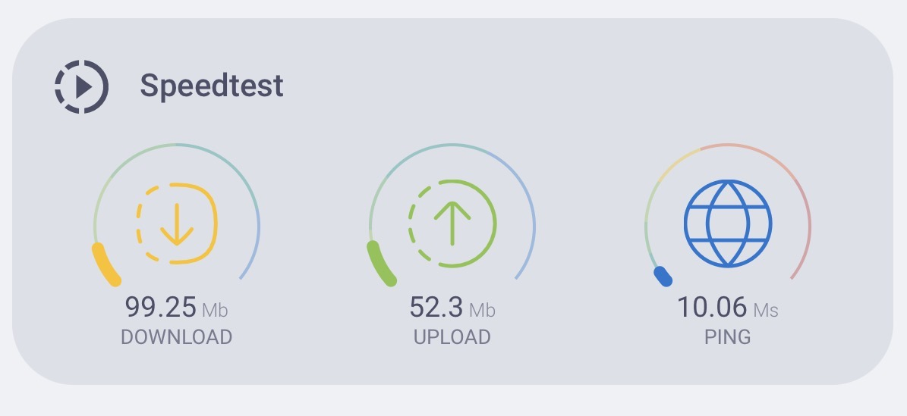

# Omnilistic Suite for Home Assistant 🎛️

A collection of precision-engineered, custom-built UI cards for your Home Assistant dashboard. Designed with modern aesthetics, zero-latency controls, dynamic animations, and clean coding principles.

---

## 📦 The Cards

### 1. Omnilistic Card (`custom:omnilistic-card`)
The flagship "Super JS Card" of the suite. A highly advanced, unified control card with dynamic media support, built-in sliders, and custom glassmorphism styling.


**Advanced Features:**
* **Dynamic Sliders & Modes:** Automatically detects your entity capabilities and provides a hidden slider that cycles between Brightness, Color Temperature, Hue, Saturation, and Media Volume.
* **Smart Media Support:** Automatically extracts album art to the card background and reveals a sleek media playback deck (Shuffle, Prev, Play/Pause, Next) when a media player is active.
* **Intelligent Animations:** Features state-based animations like `spin` (fans), `pulse` (media), `bounce` (vacuums), and `bright-idea` (lights).
* **Dual-Entity Routing:** Allows you to display a sensor (like temperature) while the slider and tap actions control a secondary entity (like a climate thermostat).
* **Haptics Engine:** Custom haptic feedback profiles (light, medium, heavy, success, warning, error, selection) on touch and slider release.

**YAML Example:**
```yaml
type: custom:omnilistic-card
entity: light.living_room
# Optional configurations available in the Visual Editor:
use_secondary_entity: false
enable_haptics: true
haptic_type: medium
styling:
  center_layout: false
  enable_animations: true
  dynamic_album_art: true
  backdrop_blur: 25
  bg_opacity: 75
```

---

### 2. Omnilistic Speedtest Card (`custom:omnilistic-speedtest`)
A dedicated network monitoring card that visualizes your bandwidth data with beautifully animated, color-coded arc gauges.



**Advanced Features:**
* **Smart Color Scaling:** Arcs dynamically change color based on predefined quality thresholds (e.g., Ping turns green under 60ms, red over 250ms).
* **Execution Scripting:** Tapping the header triggers a custom Home Assistant script to run your speedtest, activating an animated "running" speedometer icon.
* **Haptic Feedback:** Triggers a medium haptic pulse when a test is initiated.

**YAML Example:**
```yaml
type: custom:omnilistic-speedtest
name: Network Speed
script_entity: script.run_speedtest
download_entity: sensor.speedtest_download
upload_entity: sensor.speedtest_upload
ping_entity: sensor.speedtest_ping
# Icons and background color can be customized in the UI
```

---

### 3. Minimal Purifier Card (`custom:minimal-purifier-card`)
A beautifully animated, deeply integrated control interface engineered for air purifiers (perfect for devices like the Xiaomi Air Purifier 4 Lite).

*Available in both Dark and Light modes:*


**Advanced Features:**
* **Dynamic PM2.5 Engine:** The main ring and ambient glow automatically shift colors from Green (Good) to Deep Red (Hazardous) based on live Air Quality PM2.5 readings.
* **Particle Physics System:** Renders an animated canvas of floating air particles. The speed and density of the particles dynamically react to the actual fan speed percentage of your purifier.
* **Smart Controls Deck:** Dedicated buttons to cycle through Modes (Auto/Silent/Favorite), toggle the device Buzzer, and engage the Child Lock.
* **Adaptive Speed Slider:** The fan speed adjustment slider remains hidden to keep the UI clean, smoothly revealing itself *only* when the purifier is set to "Favorite" mode.
* **Filter Tracking:** Integrated monitoring for your filter's remaining life percentage and estimated days remaining.

**YAML Example:**
```yaml
type: custom:minimal-purifier-card
name: Bedroom Purifier
power_entity: fan.air_purifier
pm_entity: sensor.air_purifier_pm2_5
temperature_entity: sensor.air_purifier_temperature
humidity_entity: sensor.air_purifier_humidity
mode_entity: fan.air_purifier # or input_select
speed_entity: number.air_purifier_favorite_motor_speed
buzzer_entity: switch.air_purifier_buzzer
child_lock_entity: switch.air_purifier_child_lock
filter_life_entity: sensor.air_purifier_filter_life_remaining
filter_days_entity: sensor.air_purifier_filter_use_time
# Additional styling options (ring animation, glow, card opacity) available in the Visual Editor.
```

---

## 🚀 Installation (via HACS)
[](https://my.home-assistant.io/redirect/hacs_repository/?owner=Ya7ya-mohammed&repository=omnilistic&category=plugin)
1. Open **Home Assistant** and navigate to **HACS** > **Frontend**.
2. Click the **three dots (⋮)** in the top right corner and select **Custom repositories**.
3. Paste this link into the Repository field: `https://github.com/Ya7ya-mohammed/omnilistic`
4. Select **Dashboard** as the Category and click **Add**.
5. Click on the new **Omnilistic Suite** in your list, then click **Download**.
6. **Important:** Refresh your browser or clear your mobile app cache (`Ctrl + F5` or pull down to refresh) so Home Assistant loads the compiled cards.

*Note: All cards feature full Visual Editor support in the Home Assistant UI, making them incredibly easy to configure without writing YAML.*
