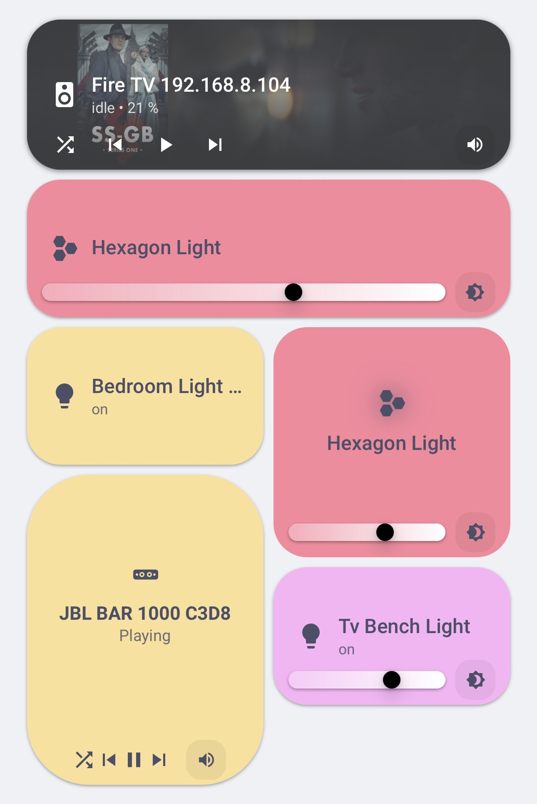
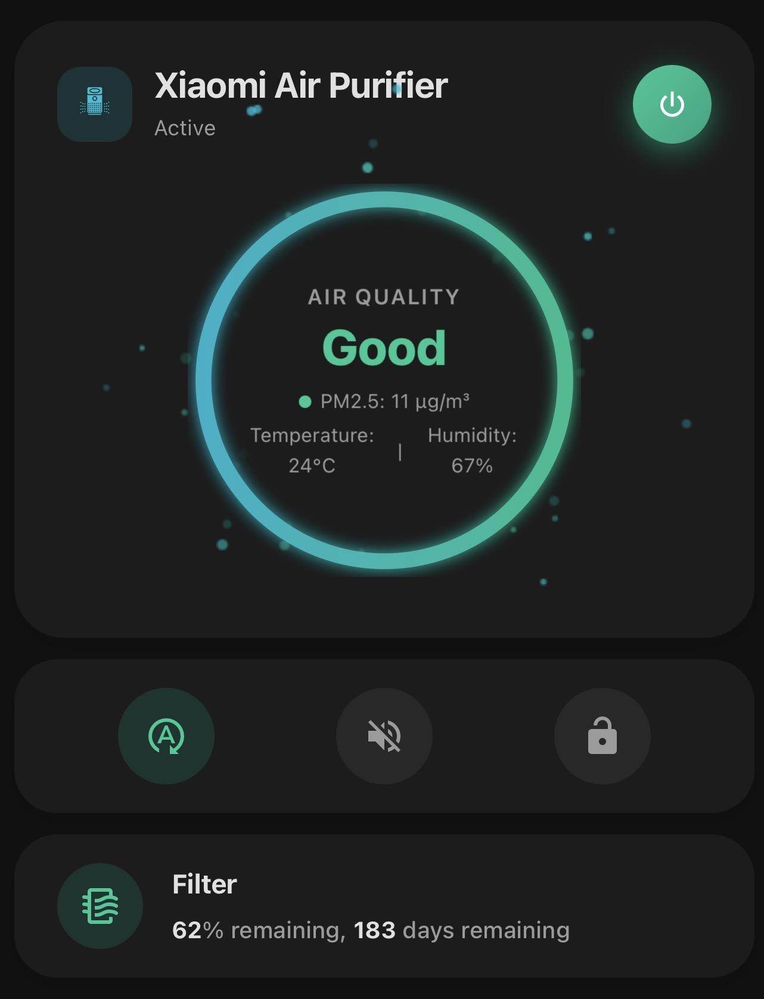
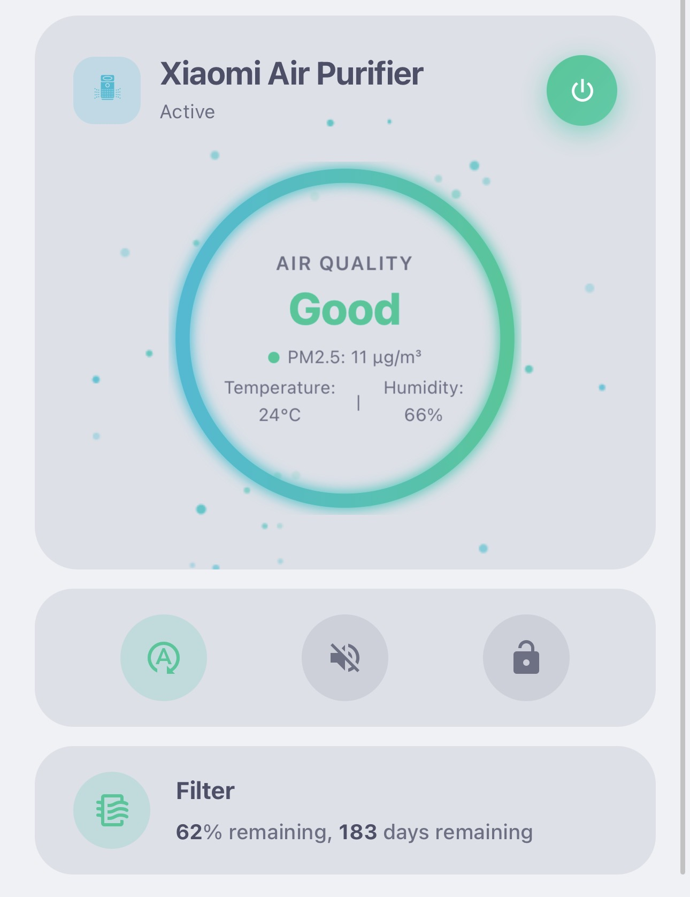

# Omnilistic Suite for Home Assistant

A collection of clean, modern, custom-built UI cards for your Home Assistant dashboard.

---

## 📦 Included Cards

### 1. Omnilistic Card (`custom:omnilistic-card`)
The main "Super JS Card" built for a high-end, unified dashboard experience.



**Key Functions & Features:**
* Displays entity states with a clean, modern layout.
* Built-in tap controls to easily toggle your devices (lights, switches, etc.) on and off.
* Advanced styling including sleek, custom CSS glass/blur effects.
* Responsive design that adapts smoothly to your dashboard layout.

```yaml
type: custom:omnilistic-card
entity: light.living_room
```

### 2. Omnilistic Speedtest Card (`custom:omnilistic-speedtest`)
A dedicated network monitoring card with a beautiful UI. 


**Key Functions & Features:**
* Visualizes raw data from your Home Assistant speedtest integration.
* Displays your Ping, Download, and Upload speeds in a clean, easy-to-read format.

```yaml
type: custom:omnilistic-speedtest
entity: sensor.speedtest_download
```

### 3. Minimal Purifier Card (`custom:minimal-purifier-card`)
A simplified, highly functional control interface dedicated specifically for the **Xiaomi Air Purifier 4 Lite**.

*Available in both Dark and Light modes:*



**Key Functions & Features:**
* Strips away standard climate clutter for a minimal footprint.
* Dedicated power toggle and fan speed controls for the Xiaomi Purifier.
* Clear display of current air quality (PM2.5) readings.

```yaml
type: custom:minimal-purifier-card
entity: fan.xiaomi_air_purifier_4_lite
```

---

## 🚀 Installation (via HACS)

1. Open **Home Assistant** and go to **HACS** > **Frontend**.
2. Click the **three dots (⋮)** in the top right corner and select **Custom repositories**.
3. Paste this link into the Repository field: `https://github.com/Ya7ya-mohammed/omnilistic`
4. Select **Dashboard** as the Category and click **Add**.
5. Click on the new **Omnilistic Suite** in your list, then click **Download**.
6. **Important:** Refresh your browser or clear your mobile app cache (`Ctrl + F5` or pull down to refresh) so Home Assistant loads the new cards.

You can now use the cards from the visual Card Picker or manually in YAML.
